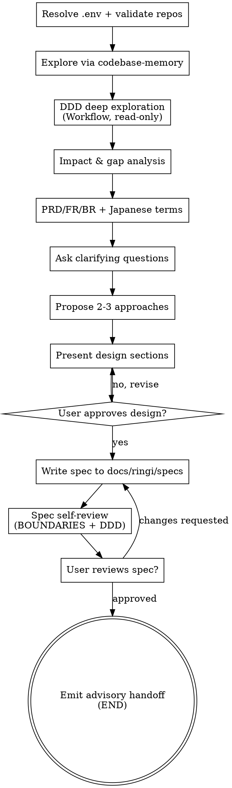

# Brainstorming Ideas Into L-DX Specs

Help turn ideas into fully formed, DDD-aware design specs through natural collaborative dialogue — then stop. This is a **read-only control-plane** (`ldx-monorepo`). Implementation never happens here; FE/BE/E2E are strictly read-only and work is handed off to separate sessions rooted at the target repo.

Start by understanding the current project context across FE/BE/E2E, then ask questions one at a time to refine the idea. Once you understand what you're building, present the design, get user approval, write the spec, and emit an advisory handoff. **You stop at the spec.**

<HARD-GATE>
Do NOT invoke any implementation skill (`writing-plans` included), write any code, scaffold any project, run any mutation (install, migrate, format, generate, stage, commit in target repos, push, rebase, branch switch), or take any implementation action. This skill's terminal state is a **committed spec + an advisory handoff prompt** — never implementation.
FE/BE/E2E repositories referenced by `.env` (`FE_PWD`/`BE_PWD`/`E2E_PWD`) are strictly read-only. Do not create, edit, move, or delete their files. Outputs live only inside this control-plane repo.
This applies to EVERY spec regardless of perceived simplicity.
</HARD-GATE>

## Anti-Pattern: "This Is Too Simple To Need A Spec"

Every change goes through this process. A single-field tweak, a config change, a one-line fix — all of them. "Simple" changes are where unexamined assumptions cause the most wasted work. The spec can be short (a few sentences for truly simple changes), but you MUST present a design and get approval.

## Read-Only Boundary

This repo is a control plane. You may **read** FE/BE/E2E and use demonstrably read-only inspection (`git status/log/diff/show`, repository-approved knowledge-graph queries). You may NOT mutate them. See repo-root `CLAUDE.md` — Non-Negotiable Read-Only Boundary.

- Write artifacts only inside this control-plane repo (e.g. `docs/ringi/specs/`).
- Preserve unrelated user changes. Never put secrets or unrelated `.env` values into an artifact.
- If implementation is requested, prepare a per-repo handoff prompt (see Implementation Handoff). Do not perform it.

## Code Intelligence (mandatory)

Per `CLAUDE.md`, use `codebase-memory` MCP **before** any source-file reading or search. Do not begin code discovery with Grep, Glob, broad Read, or shell search when the MCP is available.

| MCP project | Scope |
| --- | --- |
| `ldx-frontend` | Repository at `FE_PWD` |
| `ldx-backend` | `BE_PWD/ldx_addons` (deliberately limited — NOT complete backend blast radius) |
| `ldx-e2e` | Repository at `E2E_PWD` |

Mandatory sequence per affected project:
1. `list_projects` — select relevant project explicitly. Query every affected project for cross-repo work.
2. `get_architecture` — orientation (use `clusters` to find de-facto module seams).
3. `search_graph` — resolve symbols (functions, models, controllers, routes).
4. `trace_path` — **both directions** for callers/callees/dependencies/transitive blast radius.
5. `get_code_snippet` — only for specific qualified symbols the graph returned.
6. `detect_changes` for diff impact; `query_graph` for relationships higher-level tools miss.

Disclose gaps honestly:
- Backend graph covers `ldx_addons` only — external consumers need text search (`env['model.name']`, `_inherit`, relational comodels, manifest deps, XML IDs, routes, ACLs).
- If branch freshness matters, compare indexed root/branch/HEAD with target; disclose mismatch and ask before any refresh. **Never refresh indexes automatically.**

Text search is the fallback for literals/config and for Odoo relationships (`_name`/`_inherit`/`_inherits`/`env['...']`/comodels/manifest deps/XML IDs/`inherit_id`/routes/ACLs). State when a conclusion depends on fallback evidence.

## Checklist

Create a task for each item and complete them in order:

1. **Resolve & validate target repos** — read `FE_PWD`/`BE_PWD`/`E2E_PWD` from `.env`; for each involved repo verify key present, directory exists, and it is a Git working tree. Honor the read-only boundary. Report an invalid key instead of guessing a path.
2. **Explore FE/BE/E2E via codebase-memory** — run the mandatory sequence above across every affected project. Correlate FE routes/clients, Odoo models/controllers, and E2E flows before making cross-repo claims.
3. **DDD deep exploration via Workflow** — fan-out **read-only** agents to map aggregates, entities, value objects, and bounded-context boundaries across affected repos. Determine which `D` (domain behavior) the change touches. Disclose graph gaps. (See DDD-Aware Design.)
4. **Impact & gap analysis** — for every existing aggregate/flow the change touches: run impact analysis over the codebase (extensions, referencing models, behavior-path writes and state readers), then gap-check the findings against the requirements — behavior that exists in code but no requirement mentions is a requirements gap, i.e. a `PENDING` product question, not absence of behavior. (See Impact & Gap Analysis.)
5. **PRD / FR / BR grounding** — locate the source PRD and its Functional Requirements (FR) / Business Requirements (BR). Carry the exact requirement IDs and their original (often Japanese) wording into the spec. Preserve every Japanese term verbatim — never translate or paraphrase away a term that downstream planning must match. (See Requirements & Japanese Term Preservation.)
6. **Offer the visual companion just-in-time** — NOT upfront. Rare for Ringi/backend specs; default to terminal. See Visual Companion.
7. **Ask clarifying questions** — one at a time; understand purpose/constraints/success criteria.
8. **Propose 2-3 approaches** — with trade-offs; lead with your recommendation, explicitly **non-binding**. (CLAUDE.md Human Decision Authority — you advise, user decides.)
9. **Present design** — in sections scaled to their complexity; get user approval after each section.
10. **Write spec** — save to `docs/ringi/specs/YYYY-MM-DD-<topic>-design.md` using `spec-template.md`; include the Reversibility & Side-Effects Inventory when step 4 applies; commit.
11. **Spec self-review** — placeholders/consistency/scope/ambiguity **plus BOUNDARIES + DDD + Reversibility consistency** (see below).
12. **User reviews spec** — ask the user to review the file before proceeding.
13. **END — emit handoff** — produce an advisory implementation-handoff prompt for the target repo (see Implementation Handoff). Do NOT invoke any implementation skill.

## Process Flow

**The terminal state is emitting the handoff.** Do NOT invoke `writing-plans`, `frontend-design`, `mcp-builder`, or any other implementation skill. This skill ends at the spec + handoff.

## The Process

**Resolving targets:**
- Read `FE_PWD`/`BE_PWD`/`E2E_PWD` from `.env`. Do NOT source/execute `.env`; extract only these three values without exposing other variables.
- For each target involved: verify the key is present, the directory exists, and it is a Git working tree. Report an invalid key rather than guessing.

**Understanding the idea:**
- Run the codebase-memory mandatory sequence first to ground every claim in graph-resolved symbols/paths.
- Assess scope: if the request spans multiple independent subsystems, flag it immediately and help decompose into sub-projects. Each sub-project gets its own spec cycle. Don't refine details of a project that needs decomposition first.
- For appropriately-scoped changes, ask questions one at a time. Prefer multiple choice; open-ended is fine.
- Only one question per message — break a topic into multiple questions if needed.
- Focus on understanding: purpose, constraints, success criteria, and which `D` (domain behavior) is affected.

**Exploring approaches:**
- Propose 2-3 approaches with trade-offs. Lead with your recommendation and reasoning.
- Recommendation is explicitly **non-binding** (CLAUDE.md: you investigate, compare, identify risk; the user retains every material decision).

**Presenting the design:**
- Once you understand the change, present the design in sections.
- Scale each section to its complexity: a few sentences if straightforward, up to 200-300 words if nuanced.
- Ask after each section whether it looks right so far.
- Cover: architecture, components, data flow, **error handling & edge cases (BOUNDARIES)**, testing/verification.

**Design for isolation and clarity:**
- Break the change into smaller units that each have one clear purpose, communicate through well-defined interfaces, and can be understood and tested independently.
- For each unit: what does it do, how do you use it, and what does it depend on?
- Smaller, well-bounded units are easier to reason about and edit reliably.

**Working across FE/BE/E2E:**
- Explore the current structure before proposing changes. Follow existing patterns.
- Correlate FE routes/clients, Odoo models/controllers, and E2E flows across their projects before claiming cross-repo impact.
- Where existing code has problems that affect the work (tangled responsibilities, unclear boundaries), include targeted improvements as part of the design. Don't propose unrelated refactoring.

## DDD-Aware Design (deep)

Before writing the spec, map the domain — **deeply**, driven by Workflow fan-out. The goal is to know exactly which domain invariants and behaviors the change touches, not to produce an exhaustive textbook.

Run read-only Workflow agents to answer, per affected repo:
- **Aggregates** — which aggregate(s) does each change live in? What is the aggregate root? What invariants must the aggregate protect?
- **Entities & Value Objects** — which entities/VOs are created, modified, or read? (e.g. `account.move` vs a `Money`/`TaxRate` value object.)
- **Bounded contexts** — which contexts are involved (Sales, Invoicing, Inventory, Tax, Auth…)? Where are the seams? Any cross-context dependency?
- **The `D`** — explicitly state **which domain behavior this edit affects** ("the `D`"). A spec that doesn't name the domain behavior it changes is incomplete.
- **Domain events / state transitions** — lifecycle, period closing/reopening, archival, cancellation flows relevant here.

Disclose graph limits:
- Backend graph = `ldx_addons` only. Cross-check external consumers (`env['...']`, `_inherit`, comodels, manifest deps) via text search.
- Cite graph-resolved symbols/paths as evidence for each claim.

## Impact & Gap Analysis (standard BA practice, applied to the codebase)

Two standard requirements-engineering activities, made concrete against the repositories:

- **Impact analysis** — identify everything the change affects in the existing system.
  Requirements and approved patterns describe intent and shape, not blast radius; existing
  aggregates have extensions, consumers, and side effects in modules no requirement
  mentions. The analysis is **target-aggregate-outward**, not feature-inward.
- **Gap analysis** — compare documented requirements against actual current behavior.
  Behavior that demonstrably exists in code but that no requirement addresses is a
  **requirements gap**: it becomes a `PENDING` product question with options, never a
  silent "not required".

**When it runs — any of:**
- the feature undoes an existing flow (cancel / revert / archive / void);
- the feature extends an existing document/aggregate (new fields, behaviors, statuses);
- the feature changes status/state semantics that other code reads;
- the feature touches an existing flow's key actions (confirm / create / post / closing / import);
- the feature adds a producer or consumer of an existing aggregate;
- an integration writes into an existing model;
- **always**, when the design replicates an existing approved pattern — pattern replication
  is the single most common trigger, because the pattern looks like coverage.

**Techniques, per existing aggregate/flow the change touches (e.g. `store.sales`, `stock.picking`):**

1. **Extension sweep** — text-search `_inherit = '<model>'` / `_inherits` across ALL addons
   (and FE analogues: wrappers/HOCs around the target screens). Every extending module is
   a candidate impact owner (points, coupons, tax-free, external links, analytics, guards…).
   **Verified graph limitation:** the graph's `INHERITS` edges are Python class inheritance
   (classes point at the `Model` base) — an Odoo `_inherit = '<model>'` assignment is a
   string literal and NEVER becomes a graph edge. This sweep is therefore a mandatory text
   search, not an optional graph fallback.
2. **Referencing-model sweep** — find every model holding a relation to the target
   (comodel references, M2O/O2M/M2M, cross-module greps): histories, snapshots,
   aggregations, issued documents, reserve/reservation states, external identifiers.
   Comodel names are likewise string literals — text search, not graph traversal.
3. **Behavior-path sweep** — list the writes the target flow's key actions perform
   (directly and via inherit overrides), and the reads that depend on its state
   (list views, exports, analytics queries, crons, RFM-style scoring).
4. **Classify every finding** into exactly one:
   - `covered` — a requirement or a design item already handles it;
   - `no-impact` — read-only or display-only;
   - `out-of-scope` — explicitly excluded by a recorded user decision;
   - `PENDING` — a requirements gap needing a product/user decision; blocks design
     completion while open.
5. **For undo-type features** (cancel/revert/archive/void), refine `covered` into
   `reverse` (design undoes it) / `block` (irreversible — refuse while present) /
   `accept-stale` (documented known limitation).
6. **Record** the inventory in the spec (template section) with evidence per row; also
   record bypass points — existing entry points that would skip the new flow/guards.

**Hard rules:**
- Requirements silence (including PRD silence) about behavior that demonstrably exists in
  code is a **requirements gap** — surface it with options; never silently drop it or
  assume "not required".
- Pattern replication is not coverage: the analysis runs even when the feature exactly
  mirrors an approved pattern.
- Graph-first evidence where the graph can see it — but Odoo `_inherit`/`_name`/comodel
  strings are invisible to the graph (see the verified limitation above), so the extension
  and referencing sweeps are mandatory text search; state when a conclusion rests on it.
- Quantify before restricting usability: when a guard/blocker would refuse a high-volume
  condition (e.g. externally imported records), get the production share first.

**Cautionary tale (ringi-100 phase 3):** Store Sales cancellation was spec'd cleanly by
replicating the approved phase 1/2 pattern plus the PRD's linked-slip table; a follow-up
question then revealed that point payments, point grants, coupons, tax-free records,
formal receipts, and Smaregi/POSCM-imported slips are all consumed at confirm with no
reversal machinery — 13 modules extend `store.sales`. The analysis exists so that list is
produced during design, not after UAT.

## BOUNDARIES Edge-Case Discovery

Every spec's **Error Handling & Edge Cases** section must walk the BOUNDARIES framework. The mnemonic:

| Letter | Dimension | Probe |
|--------|-----------|-------|
| **B** | Boundary values | min, max, zero, negative, overflow, decimal precision, **rounding direction** |
| **O** | Ordering | sorted, reversed, duplicates, already-processed, distinct values per field (catches column/field transposition) |
| **U** | Unicode & encoding | emoji, RTL, special chars, multibyte, **JP character set / translation completeness** |
| **N** | Null/empty | null, undefined, empty string, whitespace-only, 0 vs null |
| **D** | Data volume | zero items, one, many, max capacity |
| **A** | Access & permissions | no auth, expired, wrong role, own vs other's data |
| **R** | Race conditions | concurrent writes, double-submit, stale reads |
| **I** | Integration failures | timeout, 5xx, partial failure, malformed response |
| **E** | Environment | timezone, locale, screen size, browser, OS |
| **S** | State transitions | valid paths, invalid transitions, re-entry, archival lifecycle, **period closing/reopening** |

For each letter, state whether it **applies** to this change and how the design handles it. If it does not apply, say so explicitly rather than omitting. Silent omission reads as "covered," which it isn't.

## Requirements & Japanese Term Preservation

L-DX requirements originate from PRDs written in Japanese. A spec that loses the original
term guarantees a downstream planning miss — the planner (or implementer) can't match the
wording the code, UI, or stakeholders expect.

**Ground the spec in the source PRD:**
- Locate the PRD and its **FR** (Functional Requirements) / **BR** (Business Requirements) for this change.
- Carry the **exact requirement IDs** (e.g. `FR-0141-03`, `BR-100-2`) into the spec and into the handoff.
- Cite the requirement text. If the PRD is Japanese, quote the Japanese alongside any English gloss — never replace the source term.

**Preserve Japanese terms verbatim — do not silently translate:**
- Keep business/domain terms (e.g. 仕訳, 請求書, 消費税, 締め, 税率, 控除) in their original Japanese. An English gloss in parentheses is fine; replacing the term is not.
- This applies everywhere Japanese appears: FR/BR text, field labels, error messages, status names, UI strings, and the JP character set under BOUNDARIES-**U**.
- Reason: the spec feeds a later planning mode. If the spec translates a term away, the planner has no anchor to the PRD and the codebase's Japanese strings — it will miss the Japanese translation requirement entirely.

**Self-check before writing the spec:** every requirement ID present in the PRD is present in the spec, and every Japanese term from the PRD that names a domain concept survives verbatim into the spec.

## After the Design

**Documentation:**
- Write the validated design (spec) to `docs/ringi/specs/YYYY-MM-DD-<topic>-design.md` using the skill's `spec-template.md`.
- Use elements-of-style:writing-clearly-and-concisely skill if available.
- Commit the spec document to git (inside this control-plane repo only).

**Spec Self-Review (BOUNDARIES + DDD):**
After writing the spec, look at it with fresh eyes:
1. **Placeholder scan:** Any "TBD", "TODO", incomplete sections, vague requirements? Fix them.
2. **Internal consistency:** Do any sections contradict each other? Does the architecture match the feature descriptions? Do FE/BE/E2E contracts line up?
3. **Scope check:** Focused enough for a single implementation handoff, or needs decomposition?
4. **Ambiguity check:** Could any requirement be interpreted two ways? If so, pick one and make it explicit.
5. **BOUNDARIES check:** Does Error Handling & Edge Cases address every letter that plausibly applies? Flag silent omissions.
6. **DDD check:** Do the affected aggregates/entities/VOs match what `trace_path` found? Is the affected `D` (domain behavior) named? Any unstated cross-context impact?
7. **Impact & gap check:** Does the inventory cover every existing aggregate/flow the change touches, with every finding classified (`covered`/`no-impact`/`out-of-scope`/`PENDING`)? For undo-type features: every side effect dispositioned `reverse`/`block`/`accept-stale`? Are `PENDING` requirements gaps listed in Open Questions? Bypass audit done (existing entry points that would skip the new flow/guards)?
8. **Requirements & Japanese check:** Are all PRD FR/BR IDs carried in? Does every Japanese domain term from the PRD survive verbatim (no silent translation)? If any term was paraphrased away, restore it.

Fix any issues inline. No need to re-review — just fix and move on.

**User Review Gate:**
After the spec review passes, ask the user to review the written spec before proceeding:
> "Spec written and committed to `<path>`. Please review it and let me know if you want to make any changes before I emit the implementation handoff."

Wait for the user's response. If they request changes, make them and re-run the review. Only proceed to the handoff once the user approves.

**Implementation Handoff (advisory):**
When the user approves the spec, emit — do not execute — a per-repo handoff for each target repository named in the spec. Follow the repo-root `CLAUDE.md` Implementation Handoff standard: goal, scoped files or symbols, relevant evidence and local rules, ordered steps, acceptance criteria, verification commands, and cross-repo dependencies. Direct the user to run each handoff in a separate agent session rooted at that target repo.

This is the **terminal state** of the skill. Do NOT invoke `writing-plans` or any implementation skill.

## Visual Companion

A browser-based companion for showing mockups, diagrams, and visual options. Available as a tool — not a mode. For Ringi/backend specs it is rarely useful; default to the terminal. Only consider it when a question would genuinely be clearer shown than told (a real layout/diagram question, not merely a UI *topic*).

**Offering the companion (just-in-time):** Do NOT offer it upfront. The first time a question would genuinely be clearer shown than told, offer it then, as its own message:
> "This next part might be easier if I show you — I can put together mockups, diagrams, and comparisons in a browser tab as we go. It's still new and can be token-intensive. Want me to? I'll open it for you."

**This offer MUST be its own message.** Only the offer — no clarifying question, summary, or other content. Wait for the user's response. If they accept, start the server with `--open`. If they decline, continue text-only and don't offer again unless they raise it.

**Per-question decision:** Even after acceptance, decide FOR EACH QUESTION whether to use the browser or the terminal. The test: **would the user understand this better by seeing it than reading it?**

- **Use the browser** for content that IS visual — mockups, wireframes, layout comparisons, architecture diagrams.
- **Use the terminal** for content that is text — requirements, conceptual choices, tradeoff lists, scope decisions.

If they agree to the companion, read the detailed guide before proceeding:
`skills/brainstorming/visual-companion.md`
